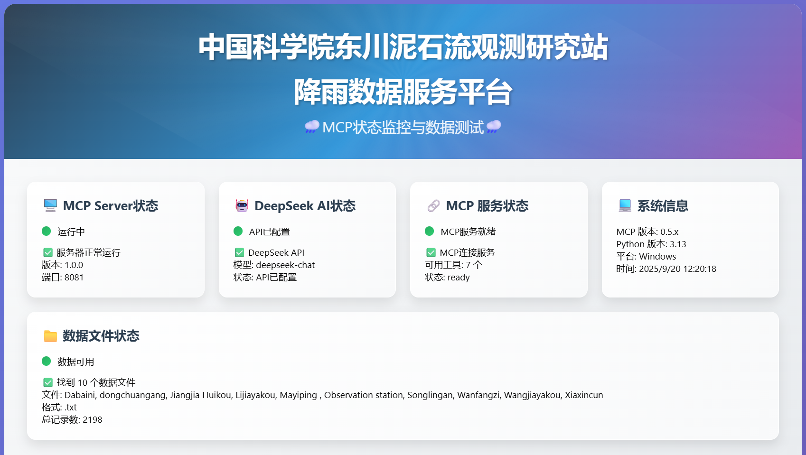

# 🌧️ 中国科学院东川泥石流观测研究站降雨数据服务 🌧️

> 基于 Model Context Protocol (MCP) 的数据服务状态监控与测试

[](https://github.com/modelcontextprotocol/python-sdk)
[](https://python.org)
[](https://www.deepseek.com)

降雨量数据查询和分析服务器，集成 DeepSeek AI 模型进行智能数据分析

---

## 🛠️ 项目简介：
MCP是Model Context Protocol的简写，由Anthropic开发的开放标准协议，主要用于AI模型与外部工具和数据源的安全连接。由于MCP的服务状态不便掌握，于是开发这个平台用于对其服务状态进行监控，同时还集成应用模型状态、MCP工具状态、数据文件和系统信息的显示，同时还集成降雨量数据的查询和分析功能，方便进行服务功能进行验证。

------

##### 🔍中国科学院东川泥石流观测研究站（http://nsl.imde.ac.cn）

中国科学院东川泥石流观测研究站（简称“东川站”）位于云南省昆明市东川区绿茂乡境内蒋家沟下游。东川站作为国家重点野外台站，以泥石流观测和实验为基础，开展泥石流基础理论和泥石流减灾技术研究，引领了国内泥石流学科发展，是国内外泥石流研究与防治的重要基地。

------

##### 📊数据来源

English name:Rainfall data at Jiangjiag Ravine and Xiaojiang River Catchment, Yunnan, China
CSTR:11738.11.NCDC.DDFORS.DB6716.2025
DOI:10.12072/ncdc.ddfors.db6716.2025
source site:State Field Observation and Research Station of Debris Fow in Dongchuan, Yunnan
contributors:Song Dongri , Zhong Wei , Li Xiaoyu , Wei Li
For the achievements published in English, please refer to the following specifications：
The dataset is provided by National Cryosphere Desert Data Center. (http://www.ncdc.ac.cn).

------

In works such as paper, patent, and monograph, please indicate the data source. In the acknowledgments section of Chinese publications, include the statement “感谢中国科学院东川泥石流观测研究站为本研究提供了相关数据” . In the acknowledgments section of English publications, please state, “We would like to thank the Dongchuan Debris Flow Observation and Research Station (DDFORS), Chinese Academy of Sciences, for providing the field observation data for this study.”For any data-related issues, please contact Li Wei (weili@imde.ac.cn) and Dongri Song (drsong@imde.ac.cn).



## 🛠️ 技术栈

### 核心技术
| 技术组件 | 版本 | 用途 |
|---------|------|------|
| **Python** | 3.8+ | 主要开发语言 |
| **MCP Protocol** | 0.5.2 | AI模型与外部工具连接协议，stdio协议 |
| **DeepSeek AI** | Latest | 智能数据分析模型 |
| **pandas** | 1.5.0+ | 数据处理与分析 |
| **asyncio** | 3.4.3+ | 异步编程框架 |

### Web技术栈
| 技术 | 用途 |
|------|------|
| **HTTP Server** | 基于Python内置服务器 |
| **HTML5/CSS3** | 现代化响应式界面 |
| **JavaScript ES6** | 交互逻辑与API调用 |
| **JSON-RPC 2.0** | MCP通信协议 |

### 数据处理
| 组件 | 支持格式 | 功能 |
|------|---------|------|
| **pandas** | CSV, TXT, XLSX | 数据读取与处理 |
| **openpyxl** | Excel文件 | 电子表格解析 |
| **多编码支持** | UTF-8, GBK, GB2312 | 中文数据处理 |


### 整体架构图
```
┌─────────────────────────────────────────────────────────────────┐
│                         用户界面层                                │
├─────────────────┬─────────────────┬─────────────────────────────┤
│   Web浏览器界面    │   MCP客户端      │      API调用接口              │
│   (8081端口)     │  (Claude等)     │    (HTTP REST)              │
└─────────────────┴─────────────────┴─────────────────────────────┘
                           │
┌─────────────────────────────────────────────────────────────────┐
│                      Web服务器层                                 │
├─────────────────┬─────────────────┬─────────────────────────────┤
│   HTTP Handler   │   API路由       │      CORS处理                │
│   异步请求处理     │   JSON响应      │      错误处理                │
└─────────────────┴─────────────────┴─────────────────────────────┘
                           │
┌─────────────────────────────────────────────────────────────────┐
│                       MCP服务层                                  │
├─────────────────┬─────────────────┬─────────────────────────────┤
│   MCP协议处理    │   工具管理       │      消息路由                │
│   JSON-RPC 2.0  │   权限控制       │      状态管理                │
└─────────────────┴─────────────────┴─────────────────────────────┘
                           │
┌─────────────────────────────────────────────────────────────────┐
│                       业务逻辑层                                  │
├─────────────────┬─────────────────┬─────────────────────────────┤
│   数据查询工具    │   AI分析工具     │      统计分析工具             │
│   降雨数据处理    │   智能问答       │      极端事件检测             │
└─────────────────┴─────────────────┴─────────────────────────────┘
                           │
┌─────────────────────────────────────────────────────────────────┐
│                       数据访问层                                  │
├─────────────────┬─────────────────┬─────────────────────────────┤
│   文件读取器     │   数据处理器     │      缓存管理                │
│   多格式支持     │   中文日期解析   │      配置管理                │
└─────────────────┴─────────────────┴─────────────────────────────┘
                           │
┌─────────────────────────────────────────────────────────────────┐
│                       外部集成层                                  │
├─────────────────┬─────────────────┬─────────────────────────────┤
│   DeepSeek API  │   本地数据文件   │      配置文件                │
│   HTTPS调用     │   CSV/TXT/XLSX  │      JSON/TXT               │
└─────────────────┴─────────────────┴─────────────────────────────┘


### 数据流转图

用户请求 → Web界面 → HTTP API → MCP工具 → 数据处理 → AI分析 → 结果返回
    ↓                                   ↓            ↓
浏览器显示 ← JSON响应 ← 格式化输出 ← 智能分析 ← 数据读取
```


## 📁 项目结构

```
MCP SERVER/
├── 🚀 启动文件
│   ├── start_all.bat              # 一键启动脚本（推荐）
│   ├── start_server.py            # MCP服务器启动
│   └── web_server.py              # Web服务器主程序
│
├── 🌐 用户界面
│   └── web_interface.html         # 现代化Web监控界面
│
├── 🔧 核心模块
│   ├── config/                    # 配置管理模块
│   │   ├── __init__.py
│   │   ├── settings.py            # 主配置文件
│   │   └── models.py              # AI模型配置
│   │
│   ├── data_handler/              # 数据处理模块
│   │   ├── __init__.py
│   │   ├── reader.py              # 多格式数据读取器
│   │   └── processor.py           # 数据分析处理器
│   │
│   ├── ai_service/                # AI服务模块
│   │   ├── __init__.py
│   │   ├── deepseek.py            # DeepSeek客户端
│   │   └── analyzer.py            # 智能分析器
│   │
│   └── mcp_server/                # MCP服务器模块
│       ├── __init__.py
│       └── tools.py               # MCP工具实现
│
├── 📊 数据目录
│   └── data/                      # 降雨量数据文件
│       ├── *.txt                  # 文本数据文件
│       ├── *.csv                  # CSV数据文件
│       └── *.xlsx                 # Excel数据文件
│
├── ⚙️ 配置文件
│   ├── requirements.txt           # Python依赖包
│   ├── deepseekkey.txt           # DeepSeek API配置
│   ├── main.py                   # 程序入口点
│   └── configure_api.py          # API配置助手
│
└── 📖 文档
    └── README.md                 # 项目文档（本文件）

### 协议架构

┌─────────────────┐    MCP Protocol    ┌─────────────────┐
│                 │ ◄────────────────► │                 │
│   MCP Client    │    JSON-RPC 2.0    │   MCP Server    │
│  (AI Assistant) │     over stdio     │ (Tools & Data)  │
│                 │                    │                 │
└─────────────────┘                    └─────────────────┘


### MCP连接流程

#### 1. 服务器启动
​```bash
python start_server.py
# 服务器监听 stdio服务，等待客户端连接
```

#### 2. 协议握手
```json
{
  "jsonrpc": "2.0",
  "id": 1,
  "method": "initialize",
  "params": {
    "protocolVersion": "2024-11-05",
    "capabilities": {
      "roots": {"listChanged": true}
    },
    "clientInfo": {
      "name": "trae-desktop",
      "version": "0.5.0"
    }
  }
}
```

#### 3. 工具发现
```json
{
  "jsonrpc": "2.0",
  "id": 2,
  "result": {
    "tools": [
      {
        "name": "query_rainfall",
        "description": "查询降雨量数据",
        "inputSchema": {
          "type": "object",
          "properties": {
            "filename": {"type": "string"},
            "filters": {"type": "object"},
            "limit": {"type": "integer"}
          }
        }
      }
    ]
  }
}
```

#### 4. 工具调用
```json
{
  "jsonrpc": "2.0",
  "id": 3,
  "method": "tools/call",
  "params": {
    "name": "query_rainfall",
    "arguments": {
      "filename": "Dabaini",
      "limit": 10
    }
  }
}
```

### MCP客户端配置

#### Trae Desktop配置
在 `%APPDATA%\\Claude\\claude_desktop_config.json` 中：
```json
{
  "mcpServers": {
    "rainfall-query": {
      "command": "python",
      "args": ["C:\\\\path\\\\to\\\\your\\\\project\\\\start_server.py"],
      "cwd": "C:\\\\path\\\\to\\\\your\\\\project"
    }
  }
}
```
## 🔧 MCP工具列表

### 1. `query_rainfall` - 数据查询
**功能**: 查询降雨数据，支持多种过滤条件
```json
{
  "filename": "Dabaini",
  "filters": {
    "start_date": "2024-01-01",
    "end_date": "2024-12-31",
    "min_rainfall": 0,
    "max_rainfall": 100
  },
  "limit": 100
}
```

### 2. `analyze_rainfall` - AI数据分析
**功能**: 使用DeepSeek AI进行智能数据分析
```json
{
  "filename": "Dabaini",
  "question": "这个地区的降雨模式如何？分析季节性变化趋势",
  "analysis_type": "general"
}
```

### 3. `rainfall_summary` - 统计摘要
**功能**: 生成全面的数据统计报告
```json
{
  "filename": "Dabaini",
  "include_ai_analysis": true
}
```

### 4. `list_datasets` - 数据集列表
**功能**: 列出所有可用的降雨数据集
```json
{
  "include_summary": true
}
```

### 5. `extreme_events` - 极端事件检测
**功能**: 检测和分析极端降雨事件
```json
{
  "filename": "Dabaini",
  "threshold_percentile": 95,
  "limit": 10
}
```

### 6. `compare_periods` - 时期比较分析
**功能**: 对比不同时间段的降雨模式
```json
{
  "filename": "Dabaini",
  "period1_start": "2024-01-01",
  "period1_end": "2024-06-30",
  "period2_start": "2024-07-01",
  "period2_end": "2024-12-31",
  "include_ai_analysis": true
}
```

### 7. `analyze_all_rainfall_data` - 全数据综合分析
**功能**: 对所有数据文件进行综合分析
```json
{
  "question": "分析所有监测站点的降雨特征和地区差异",
  "analysis_type": "regional"
}
```

## ✨ 功能特性

### 🌐 现代化Web界面
- 📊 **实时状态监控**: MCP Server、DeepSeek AI、数据文件、MCP连接状态
- 🎨 **动画效果**: 悬停动画、状态指示器、渐变背景
- 📱 **响应式设计**: 支持桌面和移动设备
- 🔧 **一键操作**: 浏览器中直接测试所有功能
- 🌍 **局域网访问**: 支持局域网中给予IP设备进行访问

### ⚙️ MCP服务器核心功能
- 📊 **智能数据查询**: 支持多种过滤条件的降雨量数据查询
- 🤖 **AI深度分析**: DeepSeek模型进行智能数据分析和模式识别
- 📈 **统计分析**: 自动生成详细的统计报告和数据摘要
- ⚡ **异常检测**: 智能识别极端降雨事件和异常模式
- 🔄 **时期比较**: 对比不同时间段的降雨模式和趋势
- 🔗 **标准协议**: 完整的MCP 2024-11-05协议实现

### 📊 数据处理能力
- 🗂️ **多格式支持**: CSV、TXT、XLSX文件格式
- 🌏 **多编码处理**: UTF-8、GBK、GB2312中文编码支持
- 📅 **智能日期解析**: 自动识别中文日期格式（如"2024年1月1日"）
- 🧮 **统计计算**: 均值、中位数、极值、标准差等统计指标
- 🔍 **数据过滤**: 按日期范围、地区、降雨量范围灵活过滤

---

## 🔧 系统要求

### 硬件要求
- **CPU**:  4核心以上处理器
- **内存**: 最小4GB，推荐6GB+
- **存储**: 至少500MB可用空间
- **网络**: 稳定的网络连接（用于AI模型API调用）

### 软件要求
- **操作系统**: Windows 10+, Linux, macOS
- **Python**: 3.8或更高版本
- **浏览器**: Chrome 80+, Firefox 75+, Safari 13+, Edge 80+

### 网络要求
- **出站连接**: 访问DeepSeek API (https://api.deepseek.com)
- **入站连接**: 8081端口（Web界面访问）
- **带宽**: 最小1Mbps上下行速度

---
## 🔍 运行机制

### 系统启动流程
```
1. 启动脚本执行
   ↓
2. 加载配置文件
   ↓
3. 初始化数据读取器
   ↓
4. 启动Web服务器 (8081端口)
   ↓
5. 加载MCP工具定义
   ↓
6. 建立AI服务连接
   ↓
7. 系统就绪，等待请求
```

### 请求处理流程
```
用户请求 → HTTP路由 → 参数验证 → MCP工具调用 → 数据处理
    ↓
结果返回 ← JSON格式化 ← 错误处理 ← AI分析 ← 数据查询
```


### AI分析流程
```
用户问题 → 数据摘要生成 → DeepSeek API调用 → 结果解析 → 格式化输出
    ↓
上下文构建 → 提示词优化 → 模型推理 → 智能分析 → 结构化返回
```


## 🔒 安全说明

### MCP安全特性
- **MCP协议**: 基于最新的MCP协议进行连接，点对点进行通讯
- **权限控制**: 客户端需要明确授权工具使用
- **数据隔离**: 敏感数据不会发送到外部服务
- **输入验证**: 严格的参数校验和清理

### API安全
- **密钥保护**: API密钥仅在本地配置文件中存储
- **请求限制**: 内置超时和重试机制
- **错误处理**: 不会泄露敏感的错误信息
- **CORS配置**: 适当的跨域资源共享设置

### 数据安全
- **本地处理**: 降雨数据仅在本地系统中处理
- **加密传输**: 与AI服务的通信使用HTTPS加密
- **访问控制**: 仅授权用户可访问系统功能


[](http://creativecommons.org/licenses/by/4.0/)  This work is licensed under a [Creative Commons Attribution 4.0 International License](http://creativecommons.org/licenses/by/4.0/).

---